# TALLER BBVA - SESIÓN 3
## Data & Analytics: AWS Glue + Athena

**Duración:** 3 horas  
**Nivel:** Intermedio  
**Caso:** Abandono y reactivación de clientes

---

## 🎯 OBJETIVO

Construir un pipeline de datos que procese transacciones bancarias para identificar:
- Clientes abandonados (60+ días sin transacción)
- Clientes reactivados (vuelven después de abandono)
- Métricas de comportamiento

---

## 🏗️ ARQUITECTURA

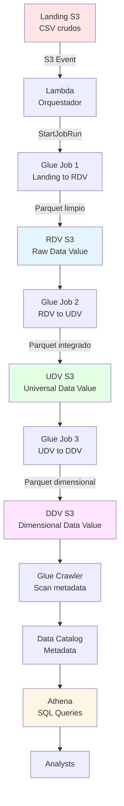

---

## 📊 CAPAS DE DATOS

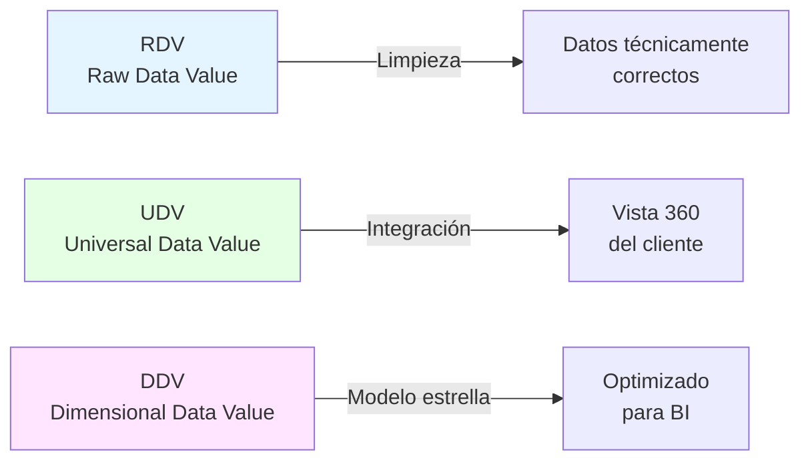

| Capa | Qué hace | Input | Output |
|------|----------|-------|--------|
| **RDV** | Limpieza técnica | CSV crudos | Parquet válido |
| **UDV** | Integración | RDV separado | Vista unificada |
| **DDV** | Modelo dimensional | UDV plano | Fact + Dims |

---

## 📦 MATERIALES

**Repo GitHub:**
```
https://github.com/ANALITIKACLOUD/hands-on-cloud
Carpeta: sesion-03-data-analytics/
```

**Datasets:**
- `maestra_clientes.csv` (1,000 clientes)
- `clientes_transacciones.csv` (10,000 transacciones)

---

# LAB 1: Setup (15 min)

## Objetivo
Crear buckets S3 + IAM Role + Subir datos

---

## PASO 1: Crear Buckets S3


### Crear 4 buckets:

| # | Nombre | Propósito |
|---|--------|-----------|
| 1 | `bbva-landing-[NOMBRE]` | Archivos CSV crudos |
| 2 | `bbva-lakehouse-rdv-[NOMBRE]` | Parquet limpio |
| 3 | `bbva-lakehouse-udv-[NOMBRE]` | Parquet integrado |
| 4 | `bbva-lakehouse-ddv-[NOMBRE]` | Parquet dimensional |

**Configuración (para los 4):**
```
Region: us-east-1
Block public access: ENABLED
Versioning: Disabled
Encryption: SSE-S3
```

> ⚠️ Reemplaza `[NOMBRE]` con tus iniciales (ej: `bbva-landing-jperez`)

---

## PASO 2: Subir Datasets

### 2.1 Descargar CSVs
Ir al repo → `sesion-03-data-analytics/datos/landing/`

Descargar:
- `maestra_clientes.csv`
- `clientes_transacciones.csv`

### 2.2 Subir a S3
```
1. Abrir bucket: bbva-landing-[NOMBRE]
2. Click "Upload"
3. Arrastrar los 2 CSVs
4. Click "Upload"
```

✅ **Verificar:** 2 archivos en Landing

---

## PASO 3: Crear IAM Role

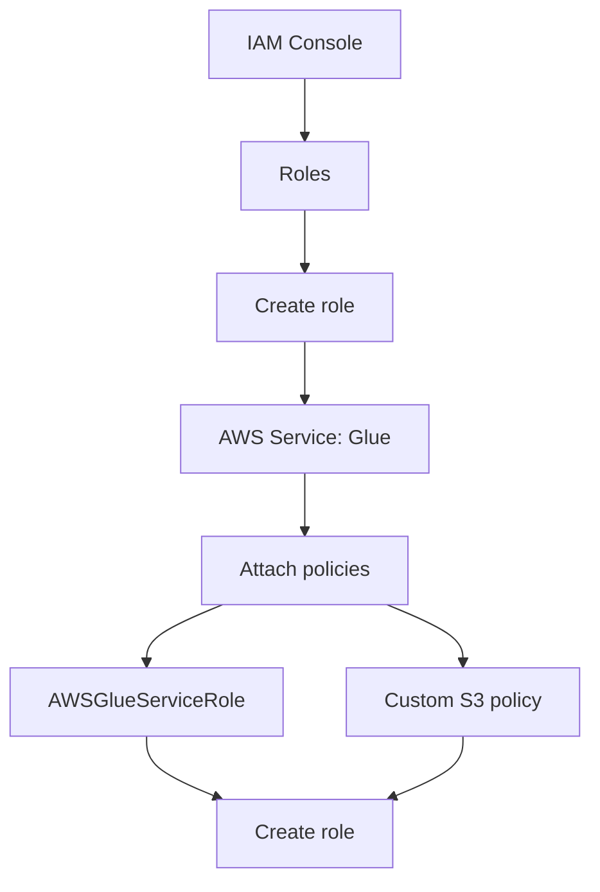

### 3.1 Configuración básica
```
Trusted entity: AWS service
Use case: Glue
Role name: GlueServiceRole-BBVA
```

### 3.2 Políticas (agregar 2)

**Política 1:** `AWSGlueServiceRole` (managed)

**Política 2:** Custom S3 access (inline)

```json
{
  "Version": "2012-10-17",
  "Statement": [
    {
      "Effect": "Allow",
      "Action": [
        "s3:GetObject",
        "s3:PutObject",
        "s3:DeleteObject"
      ],
      "Resource": [
        "arn:aws:s3:::bbva-landing-*/*",
        "arn:aws:s3:::bbva-lakehouse-*/*"
      ]
    },
    {
      "Effect": "Allow",
      "Action": "s3:ListBucket",
      "Resource": [
        "arn:aws:s3:::bbva-landing-*",
        "arn:aws:s3:::bbva-lakehouse-*"
      ]
    }
  ]
}
```

✅ **Verificar:** Role tiene 2 políticas

---

## CHECKPOINT LAB 1

- [ ] 4 buckets S3 creados
- [ ] 2 CSVs en `bbva-landing-[NOMBRE]`
- [ ] IAM Role `GlueServiceRole-BBVA` creado

---

# LAB 2: Glue Job - Landing → RDV (30 min)

## Objetivo
Limpiar y validar datos crudos

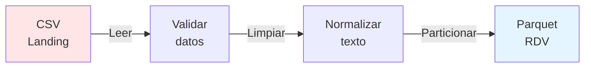

---

## PASO 1: Crear Glue Job

### 1.1 Navegación
```
AWS Console → AWS Glue → ETL jobs → Script editor
```

### 1.2 Configuración

**Job details:**
```
Name: landing-to-rdv
IAM Role: GlueServiceRole-BBVA
Type: Spark
Glue version: 4.0
Language: Python 3
Worker type: G.1X
Number of workers: 2
```

**Job parameters (agregar):**
```
--SOURCE_BUCKET = bbva-landing-[NOMBRE]
--TARGET_BUCKET = bbva-lakehouse-rdv-[NOMBRE]
--TempDir = s3://bbva-lakehouse-rdv-[NOMBRE]/temp/
```

---

## PASO 2: Script PySpark

### Descargar script
```
Repo → glue-jobs/01-landing-to-rdv.py
```

### Copiar al editor de Glue
Pegar todo el contenido en el script editor

### Guardar
Click "Save" (arriba a la derecha)

---

## PASO 3: Ejecutar

### 3.1 Run
Click "Run"

### 3.2 Monitorear
```
Tab: Runs
Status: Running → Succeeded (2-3 min)
```

### 3.3 Logs
```
Click en Run ID
Ver: Logs tab
```

**Buscar en logs:**
```
✅ Clientes leídos: 1000
✅ Transacciones leídas: 10000
✅ JOB COMPLETADO
```

---

## PASO 4: Verificar Output

### Abrir S3
```
Bucket: bbva-lakehouse-rdv-[NOMBRE]
```

### Estructura esperada
```
rdv/
├── clientes/
│   └── year=2025/
│       └── month=01/
│           └── day=XX/
│               └── *.parquet
└── transacciones/
    └── year=2024/
        └── month=12/
            └── day=XX/
                └── *.parquet
```

✅ **Verificar:** Carpetas particionadas con archivos .parquet

---

## 🎓 CONCEPTO: Parquet vs CSV

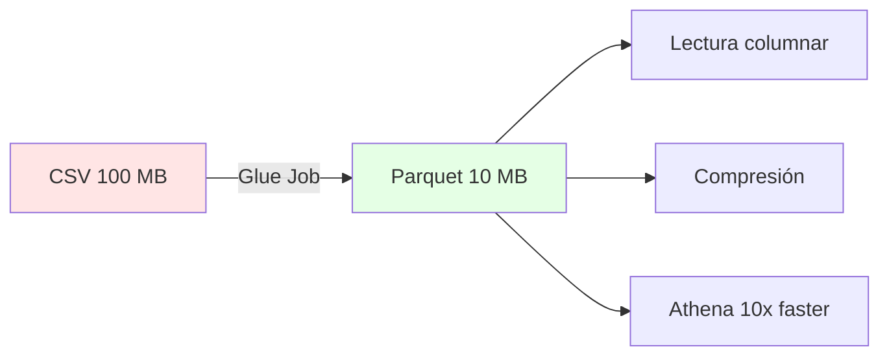

| Aspecto | CSV | Parquet |
|---------|-----|---------|
| Tamaño | 100 MB | 10 MB |
| Lectura | Completa | Solo columnas necesarias |
| Athena | Lento + caro | Rápido + barato |
| Compresión | No | Sí (Snappy) |

---

## 🎓 CONCEPTO: Particionamiento

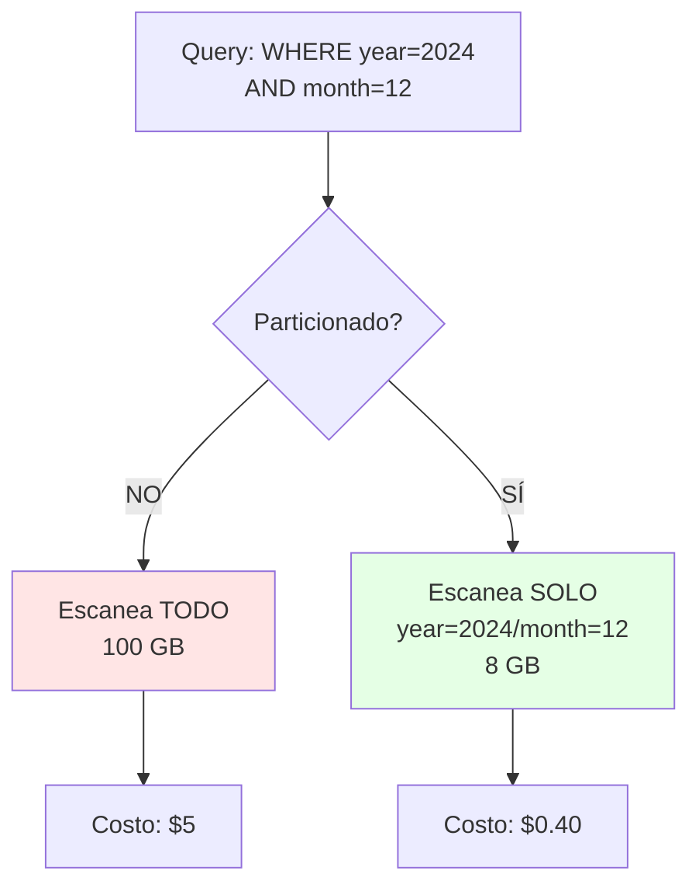

**Ventaja:** Athena solo lee particiones necesarias
**Ahorro:** 90% menos datos escaneados = 90% menos costo

---

# LAB 3: Glue Job - RDV → UDV (30 min)

## Objetivo
Integrar clientes + transacciones + Calcular métricas

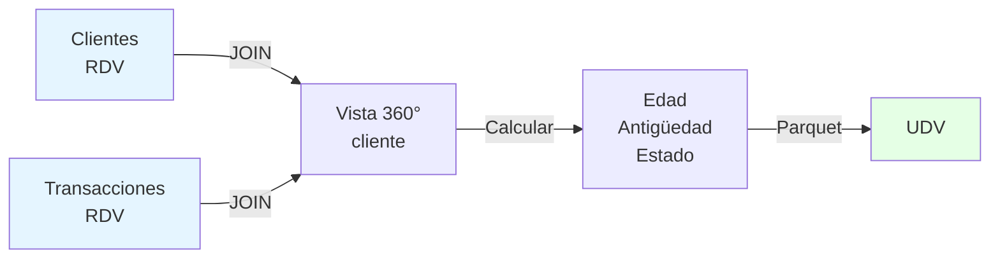

---

## PASO 1: Crear Job

### Configuración
```
Name: rdv-to-udv
IAM Role: GlueServiceRole-BBVA
Type: Spark
Glue version: 4.0
```

### Parameters
```
--SOURCE_BUCKET = bbva-lakehouse-rdv-[NOMBRE]
--TARGET_BUCKET = bbva-lakehouse-udv-[NOMBRE]
--TempDir = s3://bbva-lakehouse-udv-[NOMBRE]/temp/
```

---

## PASO 2: Script

Descargar: `glue-jobs/02-rdv-to-udv.py`

Copiar al editor → Guardar

---

## PASO 3: Ejecutar

Run → Esperar Succeeded (3-4 min)

---

## PASO 4: Verificar

### S3 Output
```
Bucket: bbva-lakehouse-udv-[NOMBRE]

Estructura:
udv/
└── clientes_360/
    └── year=2025/
        └── month=01/
            └── *.parquet
```

### Verificar en logs
```
✅ Clientes con transacciones
✅ Métricas calculadas:
   - edad
   - antiguedad_dias
   - total_transacciones
   - dias_sin_transaccion
   - estado_cliente (activo/inactivo/abandonado)
```

---

## 🎓 CONCEPTO: Vista 360°

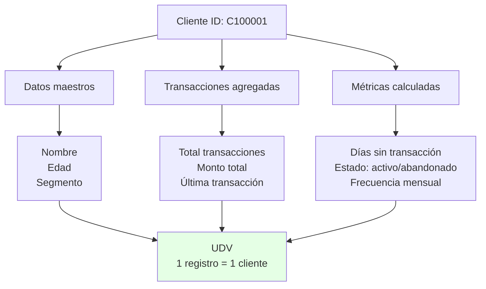

**Antes (RDV):**
- Tabla clientes: 1,000 registros
- Tabla transacciones: 10,000 registros
- **Total:** 2 tablas separadas

**Después (UDV):**
- Tabla clientes_360: 1,000 registros
- **Total:** 1 tabla con TODO

---

# LAB 4: Glue Job - UDV → DDV (30 min)

## Objetivo
Crear modelo dimensional (estrella) para BI

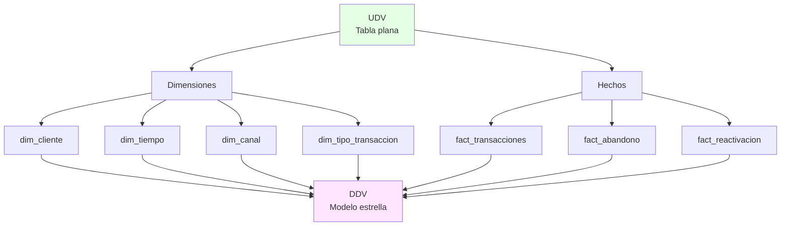

---

## PASO 1: Crear Job

```
Name: udv-to-ddv
IAM Role: GlueServiceRole-BBVA
Parameters:
  --SOURCE_BUCKET = bbva-lakehouse-udv-[NOMBRE]
  --TARGET_BUCKET = bbva-lakehouse-ddv-[NOMBRE]
```

---

## PASO 2: Script

Descargar: `glue-jobs/03-udv-to-ddv.py`

---

## PASO 3: Ejecutar

Run → Esperar (4-5 min)

---

## PASO 4: Verificar

### S3 Structure
```
ddv/
├── dim_cliente/
├── dim_tiempo/
├── dim_canal/
├── dim_tipo_transaccion/
├── fact_transacciones/
├── fact_abandono/
└── fact_reactivacion/
```

✅ **Verificar:** 7 carpetas con archivos .parquet

---

## 🎓 CONCEPTO: Modelo Estrella

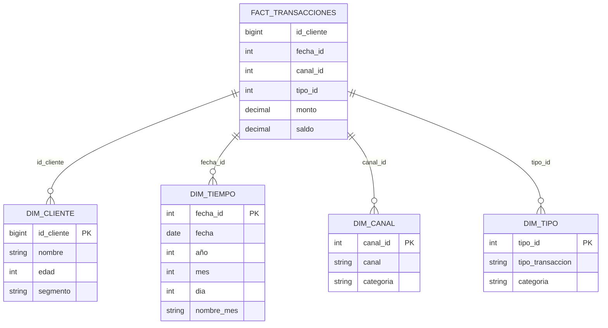

**Ventajas:**
- Queries más rápidos (JOINs simples)
- Agregaciones eficientes
- Fácil de entender para negocio
- Optimizado para BI tools

---

# LAB 5: Crawler + Data Catalog (20 min)

## Objetivo
Escanear DDV y crear metadata para Athena

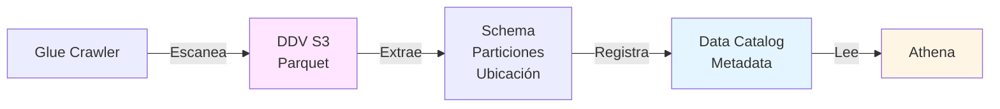

---

## PASO 1: Crear Crawler

### Navegación
```
AWS Glue → Crawlers → Create crawler
```

### Configuración

**Name:** `ddv-crawler`

**Data source:**
```
Type: S3
Path: s3://bbva-lakehouse-ddv-[NOMBRE]/
Subsequent crawler runs: Crawl all folders
```

**IAM Role:** `GlueServiceRole-BBVA`

**Target database:**
```
Database: bbva_analytics (crear si no existe)
Table prefix: ddv_
```

**Schedule:** On demand

---

## PASO 2: Run Crawler

```
1. Seleccionar crawler: ddv-crawler
2. Click "Run"
3. Esperar Status: Completed (2-3 min)
```

---

## PASO 3: Verificar Tables

### Data Catalog
```
AWS Glue → Tables
Database: bbva_analytics
```

**Tablas creadas (7):**
- `ddv_dim_cliente`
- `ddv_dim_tiempo`
- `ddv_dim_canal`
- `ddv_dim_tipo_transaccion`
- `ddv_fact_transacciones`
- `ddv_fact_abandono`
- `ddv_fact_reactivacion`

### Ver Schema
Click en cada tabla → Ver columnas y tipos

✅ **Verificar:** 7 tablas con schemas correctos

---

## 🎓 CONCEPTO: Data Catalog

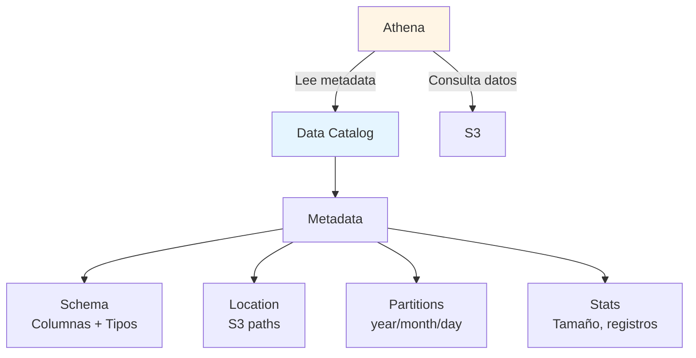

**NO almacena datos, solo metadata**

Athena usa el catalog para:
1. Saber dónde están los datos (S3 path)
2. Entender el schema (columnas/tipos)
3. Optimizar queries (particiones)

---

# LAB 6: Queries en Athena (30 min)

## Objetivo
Consultar datos con SQL y analizar métricas

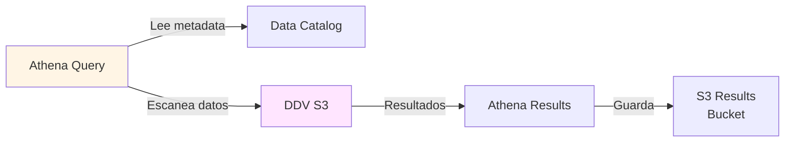

---

## PASO 1: Setup Athena

### Query Editor
```
AWS Console → Athena → Query editor
```

### Configurar Results Location
```
Settings → Manage
Query result location: s3://bbva-lakehouse-ddv-[NOMBRE]/athena-results/
Save
```

---

## PASO 2: Query 1 - Exploración

### Objetivo: Ver estructura de datos

```sql
-- Ver primeros 10 clientes
SELECT *
FROM bbva_analytics.ddv_dim_cliente
LIMIT 10;

-- Ver distribución por segmento
SELECT 
    segmento_cliente,
    COUNT(*) as total_clientes
FROM bbva_analytics.ddv_dim_cliente
GROUP BY segmento_cliente
ORDER BY total_clientes DESC;
```

**Ejecutar:** Click "Run"

✅ **Verificar:** Resultados en pantalla

---

## PASO 3: Query 2 - Clientes Abandonados

### Objetivo: Identificar clientes sin actividad 60+ días

```sql
SELECT 
    c.id_cliente,
    c.nombre_completo,
    c.segmento_cliente,
    a.dias_sin_transaccion,
    a.ultima_transaccion,
    a.transacciones_historicas,
    a.monto_total_historico
FROM bbva_analytics.ddv_fact_abandono a
JOIN bbva_analytics.ddv_dim_cliente c 
    ON a.id_cliente = c.id_cliente
WHERE a.dias_sin_transaccion >= 60
ORDER BY a.dias_sin_transaccion DESC
LIMIT 20;
```

**Analizar:**
- ¿Cuántos clientes abandonados?
- ¿Qué segmento tiene más abandono?
- ¿Cuántos días promedio sin transacción?

---

## PASO 4: Query 3 - Métricas de Abandono por Segmento

```sql
SELECT 
    c.segmento_cliente,
    COUNT(DISTINCT a.id_cliente) as clientes_abandonados,
    AVG(a.dias_sin_transaccion) as promedio_dias_abandono,
    AVG(a.monto_total_historico) as promedio_monto_historico,
    MIN(a.ultima_transaccion) as abandono_mas_antiguo
FROM bbva_analytics.ddv_fact_abandono a
JOIN bbva_analytics.ddv_dim_cliente c 
    ON a.id_cliente = c.id_cliente
GROUP BY c.segmento_cliente
ORDER BY clientes_abandonados DESC;
```

**Insight esperado:**
- Segmento Premium tiene menos abandono
- Segmento Estándar tiene más días de inactividad

---

## PASO 5: Query 4 - Reactivaciones Exitosas

### Objetivo: Clientes que volvieron después de abandonar

```sql
SELECT 
    c.id_cliente,
    c.nombre_completo,
    c.segmento_cliente,
    r.dias_abandono,
    r.fecha_reactivacion,
    r.transacciones_post_reactivacion,
    r.monto_post_reactivacion
FROM bbva_analytics.ddv_fact_reactivacion r
JOIN bbva_analytics.ddv_dim_cliente c 
    ON r.id_cliente = c.id_cliente
WHERE r.transacciones_post_reactivacion >= 2
ORDER BY r.fecha_reactivacion DESC
LIMIT 20;
```

**Analizar:**
- ¿Cuántos se reactivaron?
- ¿Cuántos días estuvieron abandonados?
- ¿Cuánto transaccionan post-reactivación?

---

## PASO 6: Query 5 - Dashboard Ejecutivo

### Objetivo: Métricas consolidadas para negocio

```sql
SELECT 
    'Total Clientes' as metrica,
    COUNT(*) as valor
FROM bbva_analytics.ddv_dim_cliente

UNION ALL

SELECT 
    'Clientes Activos',
    COUNT(*)
FROM bbva_analytics.ddv_fact_transacciones
WHERE year = 2024 AND month = 12

UNION ALL

SELECT 
    'Clientes Abandonados (60+ dias)',
    COUNT(DISTINCT id_cliente)
FROM bbva_analytics.ddv_fact_abandono
WHERE dias_sin_transaccion >= 60

UNION ALL

SELECT 
    'Clientes Reactivados',
    COUNT(DISTINCT id_cliente)
FROM bbva_analytics.ddv_fact_reactivacion

UNION ALL

SELECT 
    'Monto Total Transaccionado (Dic 2024)',
    ROUND(SUM(monto), 2)
FROM bbva_analytics.ddv_fact_transacciones
WHERE year = 2024 AND month = 12;
```

---

## 🎓 CONCEPTO: Costos Athena

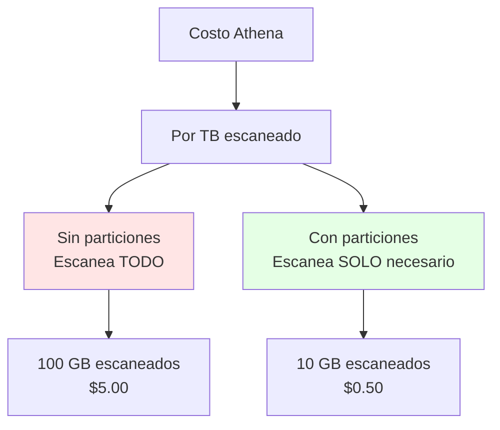

**Precio:** $5.00 por TB escaneado

**Optimizaciones:**
1. Particionamiento (ahorro 80-90%)
2. Parquet vs CSV (ahorro 80%)
3. SELECT columnas específicas (no SELECT *)
4. WHERE en particiones (year, month, day)

**Ejemplo real:**
```sql
-- ❌ CARO: Escanea 100 GB
SELECT * FROM tabla;

-- ✅ BARATO: Escanea 10 GB
SELECT id, nombre, monto
FROM tabla
WHERE year = 2024 AND month = 12;
```

---

# LAB 7: Lambda Orquestador (15 min)

## Objetivo
Ejecutar los 3 Glue Jobs secuencialmente con Lambda

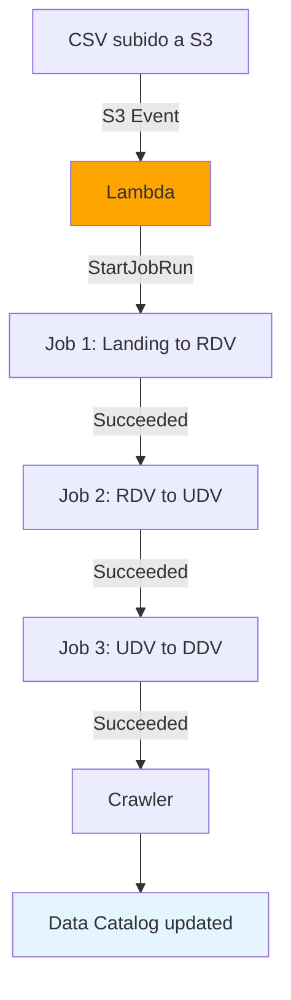

---

## PASO 1: Crear Lambda Function

### Navegación
```
AWS Lambda → Functions → Create function
```

### Configuración
```
Function name: glue-pipeline-orchestrator
Runtime: Python 3.12
Architecture: x86_64
```

### IAM Role
```
Execution role: Create new role
Role name: LambdaGlueOrchestratorRole
```

---

## PASO 2: Script Python

Descargar: `lambda/orquestador.py`

Copiar al editor Lambda → Deploy

---

## PASO 3: Agregar Permisos

### IAM Policy para Lambda

```
IAM → Roles → LambdaGlueOrchestratorRole
Add permissions → Create inline policy
```

**JSON:**
```json
{
  "Version": "2012-10-17",
  "Statement": [
    {
      "Effect": "Allow",
      "Action": [
        "glue:StartJobRun",
        "glue:GetJobRun"
      ],
      "Resource": "*"
    }
  ]
}
```

---

## PASO 4: Configurar S3 Trigger

### Navegación
```
Lambda → glue-pipeline-orchestrator → Add trigger
```

### Configuración
```
Source: S3
Bucket: bbva-landing-[NOMBRE]
Event type: PUT
Prefix: (vacío)
Suffix: .csv
```

---

## PASO 5: Probar Pipeline

### Test Manual
```
Lambda → Test tab
Create test event:
{
  "Records": [{
    "s3": {
      "bucket": {
        "name": "bbva-landing-[NOMBRE]"
      },
      "object": {
        "key": "clientes_transacciones.csv"
      }
    }
  }]
}
```

Click "Test"

### Monitorear
```
CloudWatch Logs → Log groups
/aws/lambda/glue-pipeline-orchestrator
```

**Buscar en logs:**
```
✅ Starting Job: landing-to-rdv
✅ Starting Job: rdv-to-udv
✅ Starting Job: udv-to-ddv
✅ Pipeline completed successfully
```

---

## Test End-to-End

### Subir CSV nuevo
```
1. Modificar fecha en clientes_transacciones.csv
2. Subir a s3://bbva-landing-[NOMBRE]/
3. Esperar 5-10 min
4. Verificar DDV actualizado
```

✅ **Verificar:** Pipeline completo automático

---

# 🎉 CIERRE

## ✅ LO QUE CONSTRUIMOS

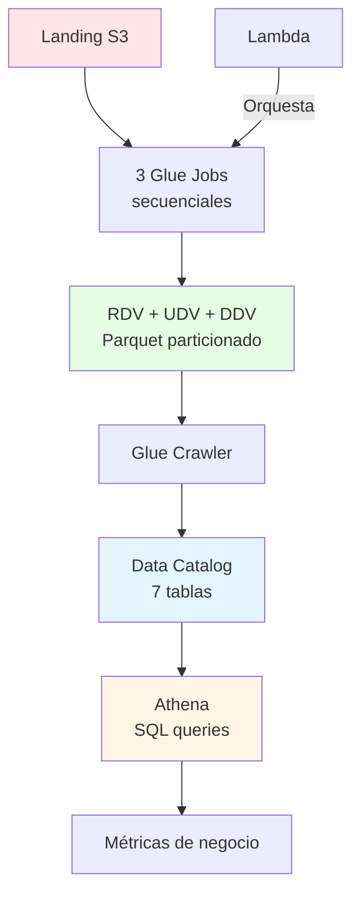

---

## 📊 MÉTRICAS CLAVE

| Métrica | Valor |
|---------|-------|
| Clientes procesados | 1,000 |
| Transacciones procesadas | 10,000 |
| Clientes abandonados | ~150 |
| Clientes reactivados | ~30 |
| Ahorro vs CSV | 80-90% |
| Tiempo total pipeline | 8-12 min |

---

## 🎓 CONCEPTOS APRENDIDOS

### Data Engineering
- **ETL con Glue** (Extract, Transform, Load)
- **PySpark** (procesamiento distribuido)
- **Capas de datos** (RDV, UDV, DDV)

### Optimización
- **Parquet** (formato columnar comprimido)
- **Particionamiento** (reducir scan de datos)
- **Catálogo de datos** (metadata centralizada)

### Arquitectura
- **Lambda** (orquestación serverless)
- **Modelo estrella** (dimensional para BI)
- **S3 Events** (triggers automáticos)

---

## 💰 COSTOS APROXIMADOS

### Por ejecución del pipeline:
```
Glue Jobs (3 x 2 DPU x 5 min): $0.15
Lambda (1 invocación): $0.0000002
S3 Storage (100 MB): $0.0023
Athena (5 queries, 50 MB): $0.00025
---
TOTAL por ejecución: ~$0.15
```

### Por mes (1 ejecución diaria):
```
$0.15 x 30 días = $4.50/mes
```

**Optimizaciones aplicadas:**
- Parquet (80% menos storage)
- Particionamiento (90% menos scan)
- Workers: 2 (no 10)

---

## 🚀 PRÓXIMOS PASOS

### Extensiones posibles:
1. **Step Functions** (orquestación visual)
2. **QuickSight** (dashboards visuales)
3. **Redshift Spectrum** (queries a escala)
4. **Glue DataBrew** (limpieza sin código)
5. **EventBridge** (scheduling avanzado)

### Mejoras:
- Alertas SNS por errores
- Dead Letter Queue para retry
- Validación de calidad de datos
- Tests unitarios de transformaciones

---

## 📚 RECURSOS

### Documentación AWS:
- AWS Glue: https://docs.aws.amazon.com/glue/
- Athena: https://docs.aws.amazon.com/athena/
- Lambda: https://docs.aws.amazon.com/lambda/

### Repositorio:
```
https://github.com/ANALITIKACLOUD/hands-on-cloud
```

### Contacto:
- Instructor: [TU CONTACTO]
- Soporte: [EMAIL]

---

## ❓ TROUBLESHOOTING

### Error: "Role not authorized"
```
Verificar IAM policies en GlueServiceRole-BBVA
```

### Error: "Access Denied S3"
```
Verificar nombres de buckets en job parameters
```

### Glue Job falla
```
Ver CloudWatch Logs:
AWS Glue → Jobs → [job-name] → Runs → Error logs
```

### Athena: "Table not found"
```
1. Verificar Crawler corrió exitosamente
2. Refresh tables en Athena
3. Verificar database: bbva_analytics
```

### Lambda no se ejecuta
```
1. Verificar S3 trigger configurado
2. Ver CloudWatch Logs
3. Test manual con event de prueba
```

---

**FIN DEL TALLER**

¡Felicitaciones! 🎉

Has construido un pipeline completo de datos en AWS.
